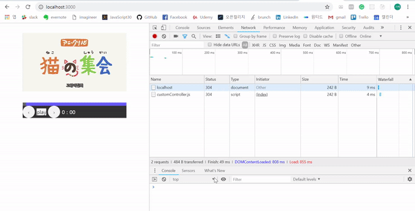
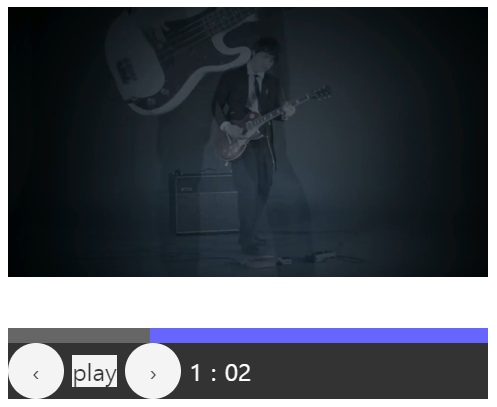
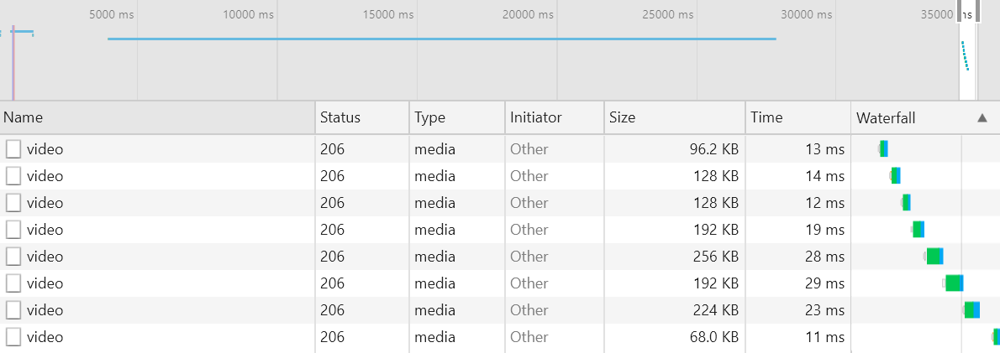
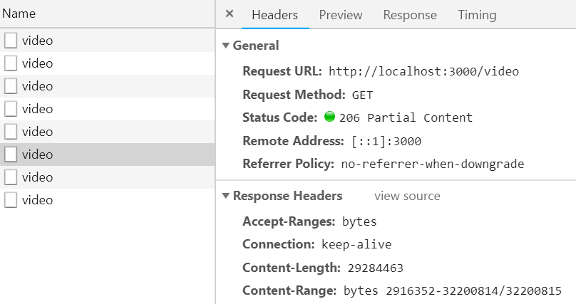

# javascript30-customVideoPlayer
Video player customising with data streaming via node.js server(Vanilla javascript coding challenge day 11)

## Getting Started
This is custom video player with server stream.

## Running the tests
step1. No installation. Fork this repository and pull it to your local enviroment. 
step2. Make video folder and put 'yourVideo.mp4' into it. 
step3. Install npm packages : $npm install 
step4. Run streaming server : $node streamingServer 
step5. Connect url 'localhost:3000' on internet browser(in my case, Chrome) and then test player buttons.

### Break down into end to end tests
- Play/Pause key : play/pause video 
- < > key : see video 2 seconds before/next 
- It shows you current play time besides '>' key.

   
  Video Player Customizing

 

   
  Chrome dev tools Network shows streaming chunks

 

   
  Confirm contents ranges

### And coding style tests
Keys are connected to video tag via DOM javascript event handling. 
About more keys which are needed below, 
- Direct change 'currentTime' with 'currNotifierNode'
- Sound keys(mute, amplify) with status bar
- Next/Prev video play keys

## Built With
- Front-end: No frameworks x No compilers x No libraries x No boilerplate. Vanilla JavaScript!
- Server: NPM(Express, app, fs, path)

## Authors
Gi-baek lee, first commit, No contribution. [More about me, LinkedIn](https://www.linkedin.com/in/kibaeklee)

## License
- Course Name: Javascript 30
- Course Instructor: Wes Bros
- Course Web site: [JavaScript30](https://javascript30.com/)
- Gif Sample Movie: [신카이 마코토 - 고양이 집회](https://www.youtube.com/watch?v=LHwHv1Zjj9w)
- Sample Video cut scene: [Thorn apple - '낯선 열대' Official MV, Youtube](https://www.youtube.com/watch?v=U6IuopxXHyg)
- Streaming server architect: [Video stream with Node.js and HTML5, medium](https://medium.com/@daspinola/video-stream-with-node-js-and-html5-320b3191a6b6)
